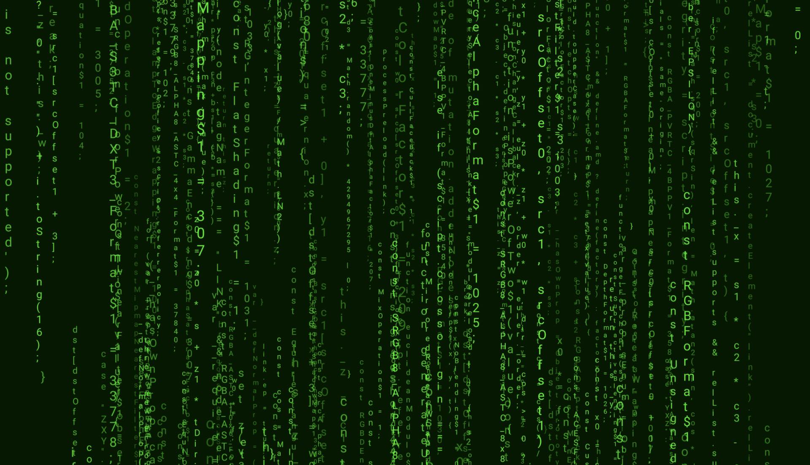

# Meta Matrix

A [WebGL](https://developer.mozilla.org/en-US/docs/Web/API/WebGL_API) demo project that renders a stylised version of it's own code (inspired by the ['digital rain'](https://en.wikipedia.org/wiki/Matrix_digital_rain) from [The Matrix](https://www.imdb.com/title/tt0133093/).



## Instructions

### Run in development mode

```shell
npm run dev
```

### Run in production mode

```shell
npm run build
npm run serve
```
